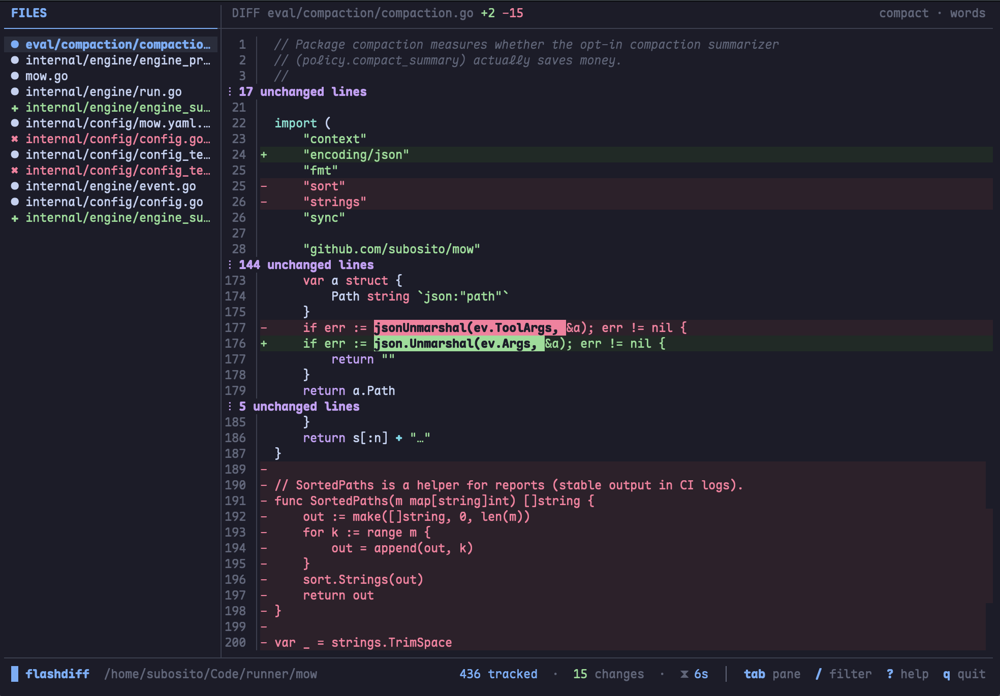

<div align="center">
  

# flashdiff

[](https://github.com/subosito/flashdiff/actions/workflows/ci.yml)
[](https://goreportcard.com/report/github.com/subosito/flashdiff)
[](https://github.com/subosito/flashdiff/releases)
[](LICENSE)

**Watch file diffs live in your terminal.**

flashdiff is a minimal TUI that monitors a directory and shows you a live
diff the moment any file is written — ideal alongside code generators,
formatters, migrations, codemods, and any tool that rewrites files while
you watch.

It complements `git diff`: instead of a post-hoc report, you get an
instant feedback loop while changes are still happening.

Built with [Bubble Tea](https://github.com/charmbracelet/bubbletea),
[Bubbles](https://github.com/charmbracelet/bubbles), and
[Lip Gloss](https://github.com/charmbracelet/lipgloss). The theme is
[Catppuccin Mocha](https://github.com/catppuccin/catppuccin) via
[Chroma](https://github.com/alecthomas/chroma), which also provides
syntax highlighting for unchanged lines in the diff view.

</div>

---



---

## Install

```sh
go install github.com/subosito/flashdiff@latest
```

Or build from source:

```sh
git clone https://github.com/subosito/flashdiff.git
cd flashdiff
go build -o flashdiff .
```

## Usage

```sh
flashdiff [flags] [path]
```

`path` defaults to the current directory. flashdiff snapshots every watched
file at startup, then diffs each subsequent write against the last-known
content.

### Flags

| Flag | Description |
|------|-------------|
| `-i`, `--include` | Glob of files to include (repeatable), e.g. `-i '**/*.go'` |
| `-e`, `--exclude` | Glob of files to exclude (repeatable) |
| `--no-vcs` | Do not respect `.gitignore` / `.ignore` files |
| `--theme` | Color theme (default: `catppuccin-mocha`) |
| `--version` | Print version and exit |
| `-h`, `--help` | Show help |

### Examples

```sh
# Watch the current directory
flashdiff

# Watch only Go files under a project
flashdiff -i '**/*.go' ~/code/myapp

# Watch but exclude generated output
flashdiff -e 'dist/**' -e '*.tmp' ./src
```

---

## Interface

```
 FILES                      │ DIFF main.go +12 -3            compact · words
 ───────────────────────────┼──────────────────────────────────────────
 ● main.go                 M│ 12 │   func main() {
 ✚ internal/new.go         A│ 13 │ -     run()
 ✖ old.txt                 D│ 13 │ +     run(ctx)
                            │ 14 │   }
                            │  ⋮ 96 unchanged lines
                            │
 ───────────────────────────┴──────────────────────────────────────────
 ▒ flashdiff  /path    128 tracked  ·  3 changes  ·  ⧗ 2s  │  tab pane  / filter  ? help  q quit
```

The layout is intentionally minimal: pane titles up top (the focused pane's
title is highlighted, no box borders), a rule separates the titles from the
content, and a single **status bar** at the bottom — set off by a thin top
rule, no background fill — with the brand and watched path on the left and
live stats plus a few key hints on the right. The vertical divider crosses
the title rule (`┼`) and meets the status bar in a single `┴` joint.

- **Status bar** — a single bottom line. On the left, a pulsing indicator
  (the watcher is live) plus the brand and watched path; on the right, the
  tracked-file count, total changes, time since the last change (`⧗`), and
  key hints.
- **FILES** — every changed file, newest first. Icons: `●` modified,
  `✚` new, `✖` deleted, `◆` binary.
- **DIFF** — the selected file's diff. Line numbers sit in their own gutter,
  separated from the content by a thin `│` rule. The diff mode and word
  granularity (`compact · words`) are right-aligned in the title. Additions
  are green, deletions red, with word-level highlighting and Catppuccin
  Mocha syntax highlighting on unchanged lines.

## Keybindings

| Key | Action |
|-----|--------|
| `j` / `↓`, `k` / `↑` | Move file selection |
| `tab` | Switch pane focus |
| `enter` / `l` | Focus the diff pane |
| `d` | Cycle diff mode: unified → compact → split |
| `u` | Toggle word-level highlighting |
| `/` | Filter the file list |
| `g` / `G` | Jump to top / bottom |
| `r` | Rescan the watched tree |
| `c` | Clear change history |
| `?` | Toggle help |
| `q` / `ctrl+c` | Quit |

The divider between panes is draggable, files can be clicked, and the mouse
wheel scrolls whichever pane is under the cursor.

## Themes

flashdiff ships with several color themes, all derived from Chroma syntax
styles so the UI palette and code highlighting stay in sync. The default is
`catppuccin-mocha`.

| Theme | Vibe |
|-------|------|
| `catppuccin-mocha` | warm dark *(default)* |
| `catppuccin-macchiato` | slightly lighter dark |
| `catppuccin-frappe` | muted dark |
| `catppuccin-latte` | light |
| `dracula` | classic dark purple |
| `gruvbox` | warm earthy |
| `monokai` | retro dark |
| `nord` | cool blue-grey |
| `solarized-dark` / `solarized-light` | balanced |
| `tokyonight-night` / `tokyonight-storm` | modern blue |
| `onedark` | clean dark |
| `doom-one` | deep blue |

```sh
flashdiff --theme=dracula
flashdiff --theme=gruvbox ~/code/myapp
```

## Diff modes

- **compact** *(default)* — unified, but long runs of unchanged lines collapse
  into a `⋮ N unchanged lines` marker, so you focus on what changed.
- **unified** — classic inline `+`/`-` diff with full context.
- **split** — side-by-side old (left) vs new (right).

Press `d` to cycle (compact → unified → split). Press `u` to toggle word-level
highlighting, which marks the exact tokens that changed within a modified line.

## How it works

1. **Baseline** — at startup, flashdiff walks the tree (honoring
   `.gitignore`/`.ignore`, skip-lists, and your include/exclude globs) and
   caches each file's content.
2. **Watch** — a recursive `fsnotify` watcher streams events; rapid writes are
   debounced and batched.
3. **Diff** — on each event the file is re-read (with a settle check so partial
   writes don't corrupt the baseline), compared against the cached content with
   a line-level diff, and the cache is updated.
4. **Render** — the newest change floats to the top of the list and its diff is
   shown, with word-level segments computed for paired changed lines.

Binary files (NUL-byte heuristic) and files over 1 MiB are shown as a
placeholder rather than diffed.

## Development

Requires **Go 1.25+** — that's the only hard dependency.

```sh
go build ./...   # build
go test ./...    # tests
go vet ./...     # vet
gofmt -l .       # should print nothing
```

`devenv.nix` is provided for contributors who use [devenv](https://devenv.sh),
but it is entirely optional. Releases are built with
[GoReleaser](https://goreleaser.com) from git tags.

## Dependency note

flashdiff pins [`github.com/sergi/go-diff`](https://github.com/sergi/go-diff)
for its diff engine. That repository is no longer actively maintained, but it
is a pure-Go port of Google's well-tested diff-match-patch algorithm — a
closed, deterministic algorithm with no network, cgo, or parser attack surface
— so a frozen version is low-risk. flashdiff uses only its `Diff` API (no Match
or Patch). If it ever becomes a problem, the intended migration path is the
zero-dependency [`aymanbagabas/go-udiff`](https://github.com/aymanbagabas/go-udiff).

## Contributing

Contributions are welcome — see [CONTRIBUTING.md](CONTRIBUTING.md). The short
version: Go 1.25+, `go build`/`go test`/`gofmt` clean, Conventional Commits,
and focused PRs.

## License

flashdiff is released under the [MIT License](LICENSE).
